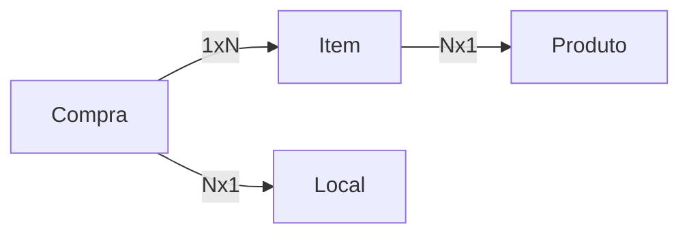

## Projeto BuyList
Projeto para captura de dados de compras salvando assim os valores gastos e os lugares de compra de cada item.

Linguagem de Programação utilizada: C# com .net versão 6.0 

Banco de dados utilizado SQL Server

ORM: Entity Framework Core 6.0.9

EndPoint de acesso a API: https://randisbuylist.azurewebsites.net/swagger/index.html

**Objetos Utilizados:**
 - Compra 
 - Item 
 - Produto 
 - Local

**Projetos :**

 - *Buylist.Api* : Projeto referente a API 
 - *Buylist.Common.Repository.Entity* : Projeto que implementa o CRUD como classe abstrata 
 - *Buylist.CommonRepository*  :  Projeto de Interface do Repositório
 - *Buylist.DataAccess* : Projeto que trata a comunição com o banco de dados (Code First)
 - *Buylist.Domain* : Projeto que possui os domínios dos objetos
 - *Buylist.Repository* :  Projeto da implementação do CRUD para cada objeto necessário

