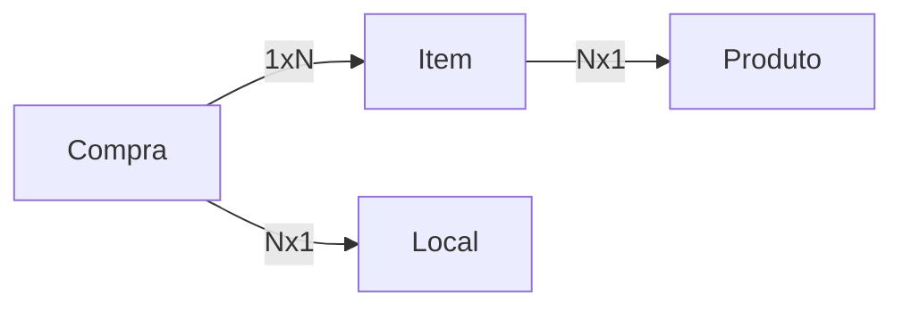

## Projeto BuyList
Projeto para captura de dados de compras salvando assim os valores gastos e os lugares de compra de cada item.

Linguagem de Programação utilizada: C# com .net versão 6.0 

Banco de dados utilizado SQL Server

ORM: Entity Framework Core 6.0.9

EndPoint de acesso a API: https://randisbuylist.azurewebsites.net/swagger/index.html

**Objetos Utilizados:**
 - Compra 
 - Item 
 - Produto 
 - Local

**Projetos :**

 - *Buylist.Api* : Projeto referente a API 
 - *Buylist.Common.Repository.Entity* : Projeto que implementa o CRUD como classe abstrata 
 - *Buylist.CommonRepository*  :  Projeto de Interface do Repositório
 - *Buylist.DataAccess* : Projeto que trata a comunição com o banco de dados (Code First)
 - *Buylist.Domain* : Projeto que possui os domínios dos objetos
 - *Buylist.Repository* :  Projeto da implementação do CRUD para cada objeto necessário

**Container**
 - Baixar a imagem do container SQL
docker pull mcr.microsoft.com/mssql/server:2019-CU18-ubuntu-20.04

 - Criar o container SQLServer Ubuntu
docker run -e "ACCEPT_EULA=Y" -e "MSSQL_SA_PASSWORD=9173-LASsols" -e "MSSQL_PID=Express" -p 1433:1433 -d mcr.microsoft.com/mssql/server:2019-CU18-ubuntu-20.04

 - Abir prompt de comando do SQL
docker exec -it ID_DO_CONTAINER /opt/mssql-tools/bin/sqlcmd -S localhost -U sa

 - Criação do Banco de Dados
CREATE DATABASE buylist
SELECT Name from sys.Databases
GO

 docker commit confident_carson buylistcontainer.azurecr.io/sqlserver/buylist:0.1.0
 
 docker login
 
 docker push buylistcontainer.azurecr.io/sqlserver/buylist:0.1.0
